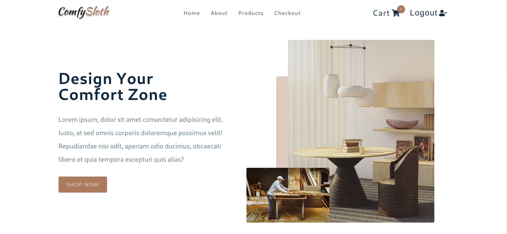
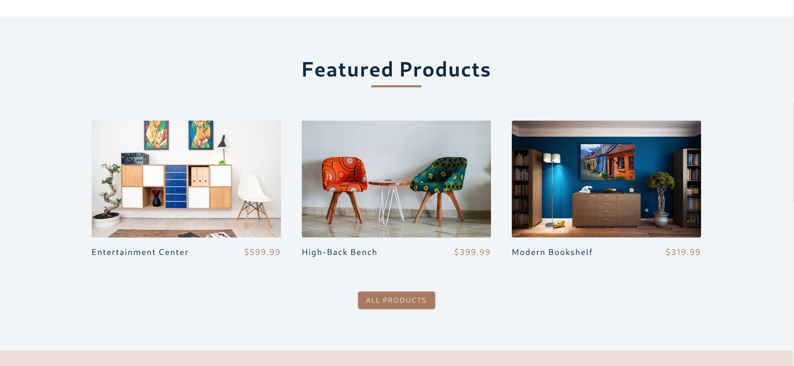
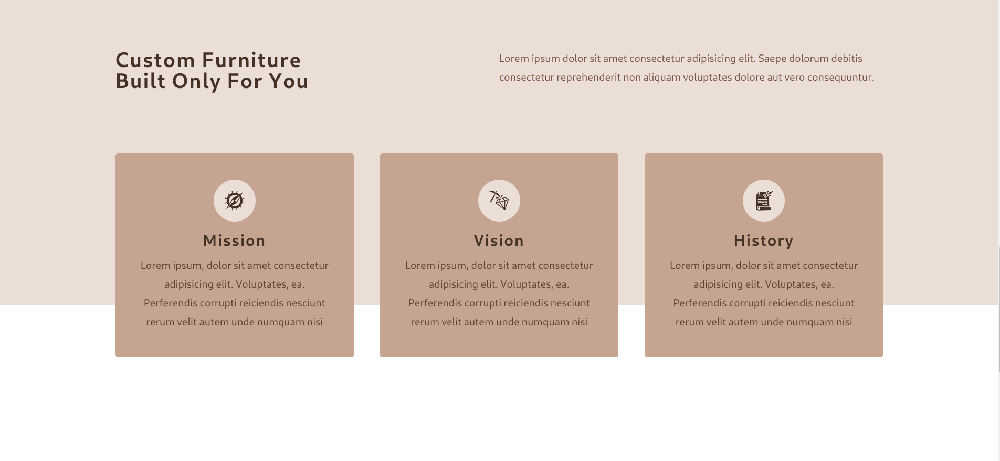
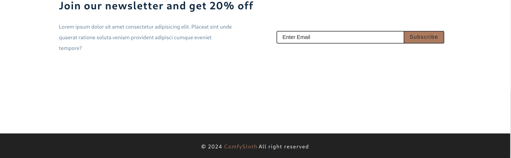
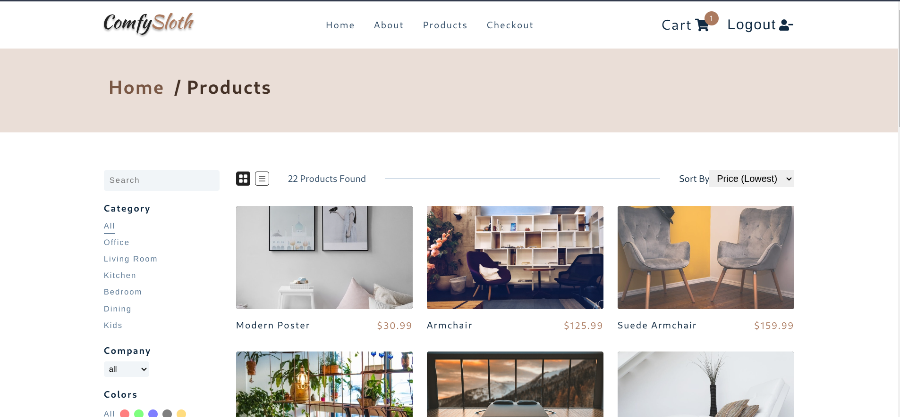
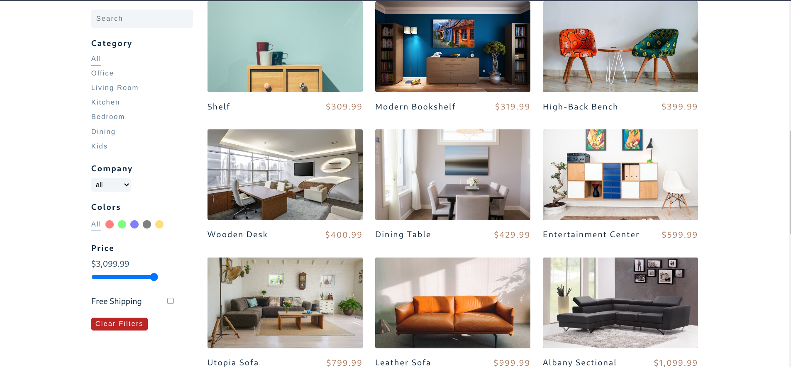

# Comfy Store

[React Comfy Sloth Store](https://myreact-comfy-sloth-project.netlify.app/)

### Run The App Locally

```bash
npm install
npm start
```

```bash
ntl dev
```

#### Screenshots









---

#### Styled Components

- [Styled Components Docs](https://styled-components.com/)

```sh
```